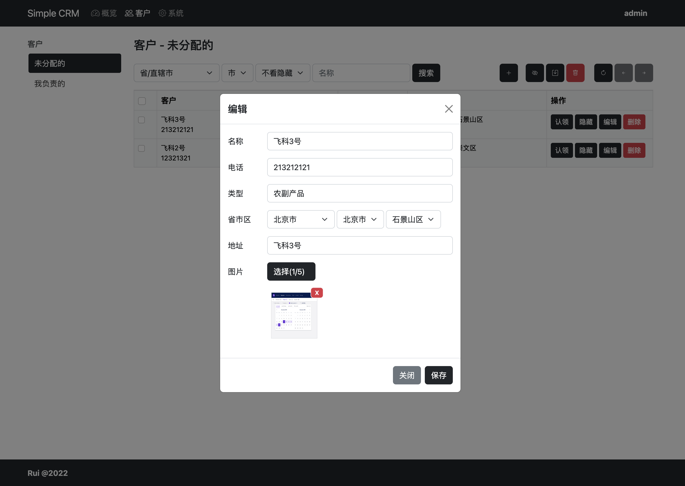
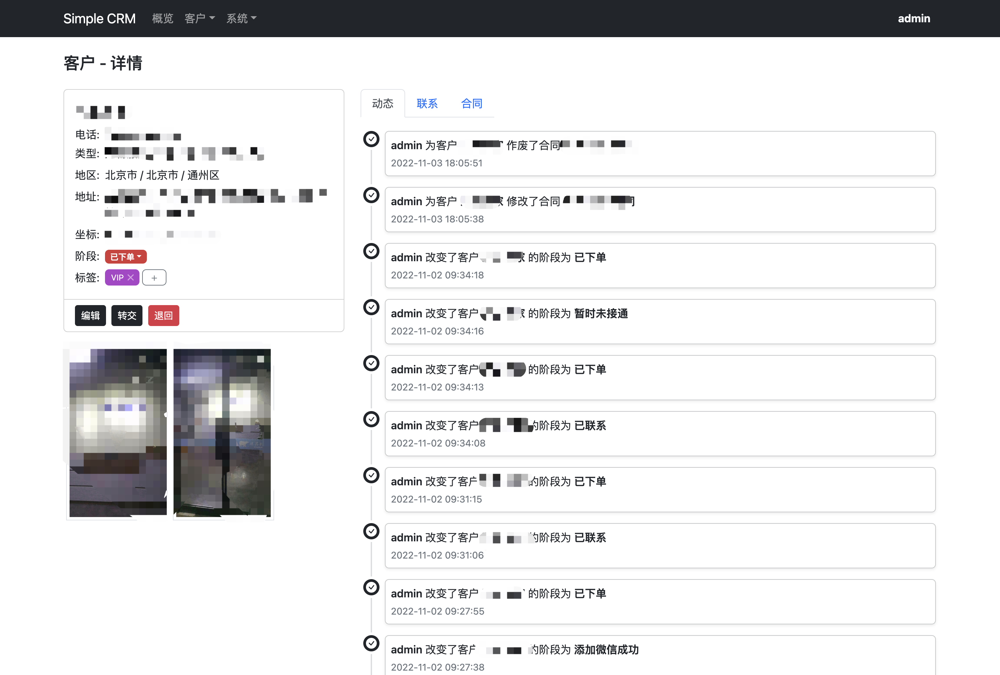
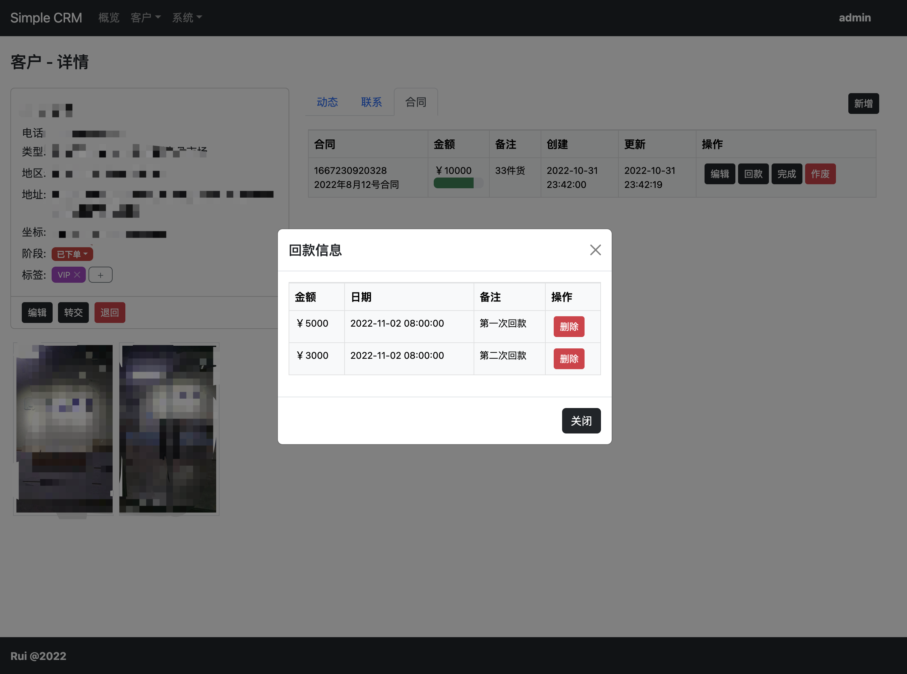

# Simple CRM

## 简介

Simple CRM 天然契合小微企业或者小团队及个人使用。以客户为中心，以人为本，促成交，存数据，挖价值，创业绩。

* 不懂CRM？没有关系，Simple CRM 没有难懂的概念，不需多高的文化和知识.
* 就几个销售？那刚刚好，Simple CRM 没有复杂的组织管理和权限设置，开箱即用。
* 找不到客户？都给你准备好了，Simple CRM 可以帮助你搜索客户，即刻联系。
* 担心数据？完全放心，Simple CRM 可以部署在你自己的电脑或者内部服务器上，当然，它也可以在云上。

从寻找客户，联系客户，管理客户，达到成交，以及维持关系。都是你熟悉的事情。

## 背景

Simple CRM 的诞生来自于一次朋友小D的公司的需求。小D最开始只有一个人进行贸易业务，由于其脑子灵活点子骚，胆大心细口才好，公司有了起色，业务量增加，客户量增加，客户来源也增多。这个时候，单干就顾不过来了，所以小D招了几个业务员，同时他也需要一个简单的CRM工具来挖掘收集潜在客户，然后把这些客户分配给业务员进行销售。所以Simple CRM只有两个参与角色，**主管**和**员工**。

* 主管：主管拥有所有的能力，包括管理员工、客户标签、客户阶段等等，以及创建客户或者爬取客户，编辑和删除客户。以及对客户开展业务。
* 员工：员工只能领取客户和对客户开展业务。

有了 Simple CRM 小D每天的工作变成了收集潜在客户，分辨潜在客户，不合适的删除，合适的让业务员领取进行跟踪。到目前为止已经收集了19万潜在客户，成功下单的有不少了，几个业务员天天工作都很饱和，他非常感谢我给我他做的 Simple CRM 。

我想类似小D这样的小微企业或者个人非常多，他们没有多少成本来购买CRM系统，我开源了Simple CRM，希望能帮助到他们。

## 技术栈

* Language: NodeJS v16
* Framework: Fastify
* Database: SQLite
* ORM: Prisma
* Template: Nunjucks
* Styling: Bootstrap v5
* Chart: AntV G2

## 环境和工具

* OS: macOS Ventura
* IDE: Visual Studio Code
* DBTool: Beekeeper Studio

## 灵感来源

* [Dribbble](https://dribbble.com/)
* [tabler](https://preview.tabler.io/)

## 功能

* 用户列表
* 用户的添加、锁定、解锁、编辑和删除
* 用户的登录和登出
* 用户修改基本信息和密码
* 客户列表、明细
* 用户上传和删除客户图片
* 用户转交、编辑、屏蔽、取消屏蔽、退回、删除客户
* 用户对客户添加、编辑和删除联系
* 用户对客户添加、删除标签
* 用户更改客户阶段
* 用户通过百度和高德地图API收集客户信息
* 用户对客户创建、编辑、作废、完成合同
* 用户对客户的合同创建、删除回款
* 用户创建、编辑、删除、查看产品
* 用户对客户的合同创建、编辑、删除产品
* 仪表盘相关统计和展示
* 系统记录用户动态
* 用户查看自己或者用户的动态
* 联系类型的创建、编辑和删除
* 客户阶段的创建、编辑和删除
* 客户标签的创建、编辑和删除

到今天（2022-11-29），基本想做的功能都差不多做完了。当然还有很多可以做，比如开票，比如组织结构，比如任务，比如审批等等。但是，这样就不是面对小微企业和个人了。所以功能今天就封了，后面就是优化和折腾了，比如用react或vue将复杂逻辑的页面重写，比如更好的UI之类的。

## 截图

<div>
    
    
    
    
    
    
    
    
    
</div>

## 运行

修改.env.example为.env，并且填入两个地图对应的的API调用KEY，是服务端KEY，这个可以到对应的地图开发者页面免费申请。没有KEY也可以使用，只是无法使用收集客户数据的能力。

```shell
git clone https://github.com/ruislan/simple-crm.git
cd simple-crm
yarn install
yarn prisma db push
yarn prisma db seed
yarn start:dev
```

Win环境下注意修改package.json中的命令start:dev，将NODE_ENV进行单独设置（set NODE_ENV=dev）。
启动成功后访问：<http://localhost:5600>

```text
Admin User
User: admin
Pass: 123123

Normal User
User: user1
Pass: 123123
```

不想这么麻烦？我搭建了一个[演示地址](https://sc.ruislan.com)，每日会重置数据。

## Docker

```bash
docker build --pull --rm -f "Dockerfile" -t simple-crm:latest .
docker run --rm -d -p 5600:5600/tcp simple-crm:latest
```
