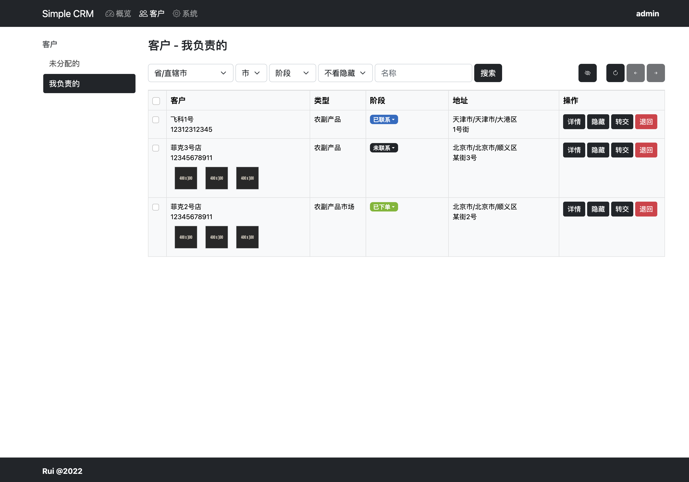
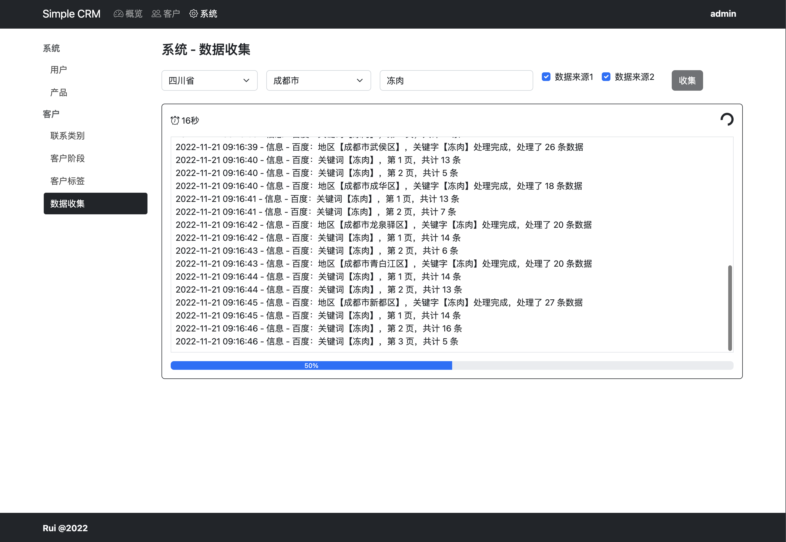
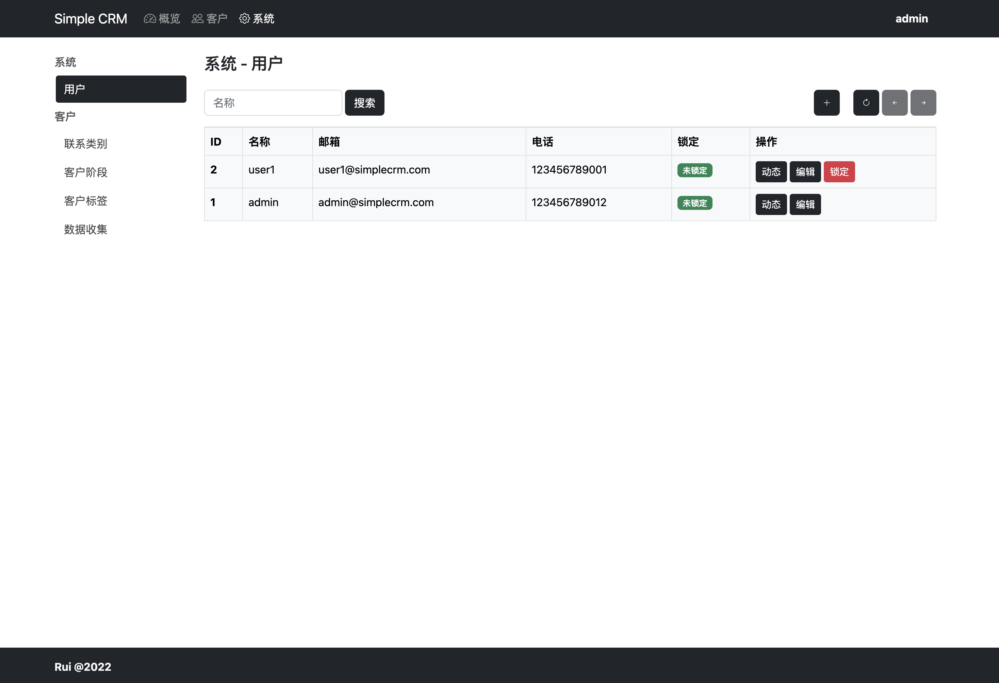

# Simple CRM

## 简介

不懂CRM，没有关系，你只要会做业务，就会用Simple CRM。
没有什么难以理解的概念，不需要更多的文化和知识，适合中小微企业。
从寻找客户，联系客户，管理客户，最后达到成交，以及维持关系。都是你熟悉的事情。

## 技术栈

* Framework: Fastify
* Database: SQLite
* ORM: Prisma
* Styling: Bootstrap

## 功能

### 用户

1. 用户列表 O
2. 用户的添加、编辑和删除 O
3. 用户的登录 O
4. 用户的基本信息修改 O
5. 用户的密码修改 O
6. 用户的锁定和解锁 O
7. 用户操作记录，便于审计

### 客户

1. 客户列表 O
2. 客户明细 O
3. 客户地图展示
4. 客户上传、删除图片 O
5. 转交客户 O
6. 退回客户 O
7. 编辑客户 O
8. 删除客户 O
9. 对客户添加联系 O
10. 修改联系 O
11. 删除联系 O
12. 数据获取 G和B （O）
13. 客户添加标签 O
14. 标签增加颜色，方便辨识 O
15. 未认领客户员工筛选过滤（每个员工保存各自的过滤）
16. 阶段加颜色，方便辨识

### 收益

1. 客户收益创建
2. 客户收益编辑
3. 客户收益删除
4. 收益统计
5. 收益预测

### 配置

1. 联系类型的创建、编辑和删除 O
2. 客户阶段的创建、编辑和删除 O
3. 客户标签的创建、编辑和删除

### 待思考功能

1. 客户联系可以直接发邮件（对接邮件服务器？）
2. 客户联系可以直接打电话（对接call center？）
3. 客户联系可以直接开视频会议（对接视频会议？）

## 截图

<div>
    
    
    
    
    
    
    
</div>

## 运行

修改.env.example为.env，并且填入两个地图对应的的API调用KEY，是服务端KEY，这个可以到对应的地图开发者页面免费申请。没有KEY也可以使用，只是不能收集数据。

```shell
git clone https://github.com/ruislan/simple-crm.git
cd simple-crm
yarn install
yarn prisma db push
yarn prisma db seed
yarn start:dev  
```

访问：<http://localhost:5600>

```
Admin User
User: admin
Pass: 123123

Normal User
User: user1
Pass: 123123
```

## Docker

docker build --pull --rm -f "Dockerfile" -t simple-crm:latest "server"

docker run --rm -d  -p 5700:5700/tcp simple-crm:latest
